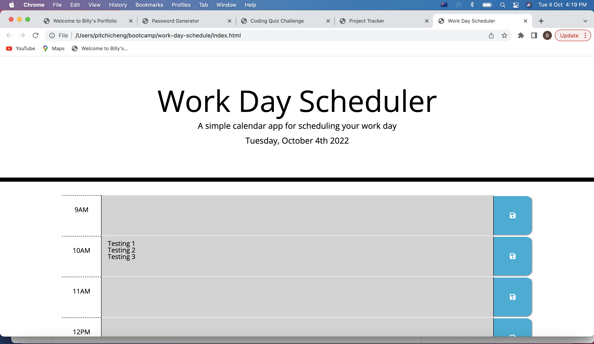
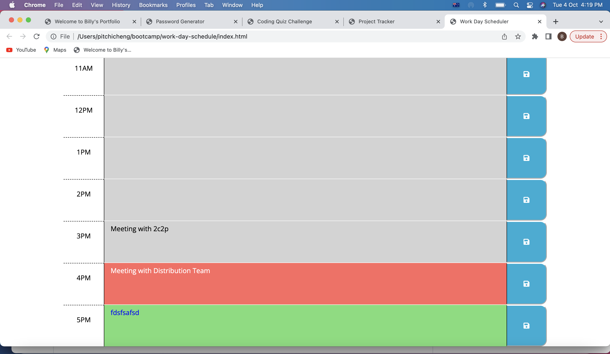
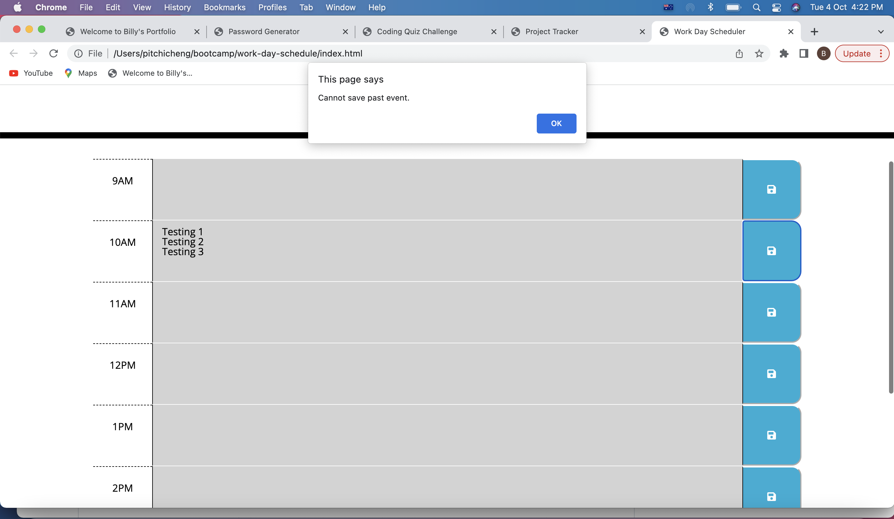
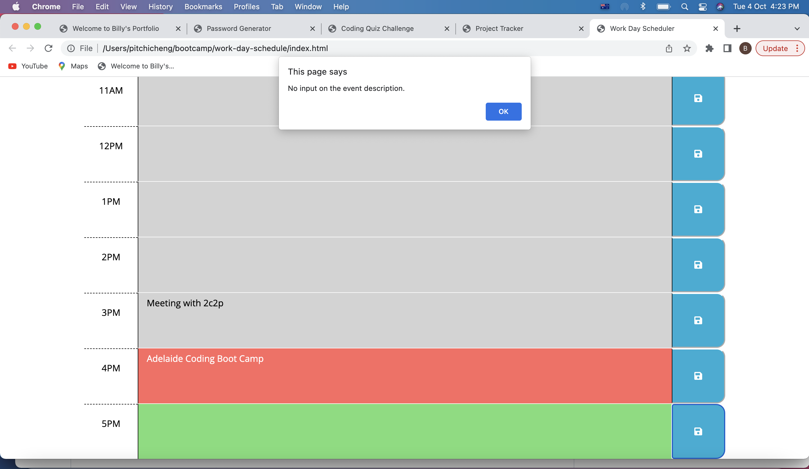

# 05 Work Day Scheduler

## Overview 

This is the challenge after completing the week 5 (Third Party APIs) of the Adelaide University Coding Bootcamp. 

## User Story

```md
AS AN employee with a busy schedule
I WANT to add important events to a daily planner
SO THAT I can manage my time effectively
```

## Acceptance Criteria

```md
GIVEN I am using a daily planner to create a schedule
WHEN I open the planner
THEN the current day is displayed at the top of the calendar
WHEN I scroll down
THEN I am presented with timeblocks for standard business hours
WHEN I view the timeblocks for that day
THEN each timeblock is color coded to indicate whether it is in the past, present, or future
WHEN I click into a timeblock
THEN I can enter an event
WHEN I click the save button for that timeblock
THEN the text for that event is saved in local storage
WHEN I refresh the page
THEN the saved events persist
```

## Solution

Steps to resolve the Challenge:

1. Examine the starter code for the available style in the css file. 

2. Use moment.js to get and format the current date and display on the header. 

3. Based on the current styles in css file, build a sample time-block with responsive design by bootstrap framework in the html file. 

4. Convert the time-block built in html by dynamically generating the elements using jQuery.

5. Add delegated event listerners to the save buttons of each row in the time-block.

6. Add save event function to save the user input to the local storage.

7. Add coding to retrieve the saved events when rendering the time-block. 

8. Add validations and checkings to the program to avoid wrong user inputs and operations causing errors to the program. 

<br>

## Test Cases and Result

| Test Case | Testing Criteria                                                     | Expected Result                                                                                                             | Actual Result | Result |
|:---------:|----------------------------------------------------------------------|-----------------------------------------------------------------------------------------------------------------------------|:-------------:|:------:|
|     1     | Load the page in the Chrome browser.                                 | The current date is displayed on the header.  The time blocks of standard business hour (9AM to 5PM) is rendered correctly  |  As expected  |  Pass  |
|     2     | Check the color of the event column.                                 | Different colours is displayed for past, present and future events.                                                         |  As expected  |  Pass  |
|     3     | Try to input information to the past event.                          | The past event is disabled and not allow to input.                                                                          |  As expected  |  Pass  |
|     4     | Try to click save button for the past event.                         | A message is shown to notify user that cannot save past events.                                                             |  As expected  |  Pass  |
|     5     | Try to input information to the present event.                       | User is allowed to input in the present event.                                                                              |  As expected  |  Pass  |
|     6     | Try to click save button for the present event.                      | The present event is saved successfully.                                                                                    |  As expected  |  Pass  |
|     7     | Try to input information to the future event.                        | User is allowed to input in the future event.                                                                               |  As expected  |  Pass  |
|     8     | Try to click save button for the future event.                       | The future event is saved successfully.                                                                                     |  As expected  |  Pass  |
|     9     | Close the browser session. Open another session and reload the page. | All the save events are shown on the screens.                                                                               |  As expected  |  Pass  |
|     10    | Click save button for the event without any input.                   | A message is shown to notify user that no input in the event description.                                                   |  As expected  |  Pass  |

<br>

## Live URL 

https://chengpitchi.github.io/work-day-schedule/
<br>

## Screenshots for the Solution


<br>

<br>

<br>

<br>

<br>

## Installation

No Installation requried.

## License 

Not Applicable
